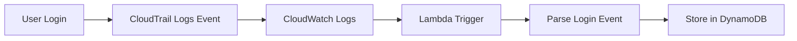

# Session Management & User Activity Monitoring Guide

## Overview

This guide explains how user session data is tracked and stored using CloudTrail, CloudWatch Logs, DynamoDB, and Lambda in your Terraform infrastructure.

## Architecture Components

### 1. CloudTrail
- **Purpose**: Logs all AWS API calls and console activities
- **Storage**: S3 bucket + CloudWatch Logs
- **Coverage**: Management events, data events, and console logins

### 2. CloudWatch Logs
- **Purpose**: Real-time log streaming and filtering
- **Log Group**: `/aws/cloudtrail/{environment}-{project_name}`
- **Retention**: Configurable (default: 90 days)

### 3. DynamoDB Table
- **Purpose**: Store structured session metadata
- **Table Name**: `{environment}-{project_name}-user-sessions`
- **Schema**:
  ```
  Partition Key: username (String)
  Sort Key: session_id (String)
  Attributes:
    - login_time (String) - ISO timestamp
    - logout_time (String) - ISO timestamp (optional)
    - ip_address (String) - Source IP
    - user_agent (String) - Browser/client info
    - session_type (String) - console_login, api_activity
    - activity (String) - Specific action performed
    - ttl (Number) - Auto-deletion timestamp
  ```

### 4. Lambda Function
- **Purpose**: Process CloudTrail logs and extract session data
- **Trigger**: CloudWatch Logs subscription filter
- **Function**: Parse login events and store in DynamoDB

## User Roles and Permissions

### Developers (developer1, developer2, developer3)
```json
{
  "Permissions": [
    "EC2: Describe, Start, Stop, Reboot instances",
    "S3: Read, Write, Delete objects",
    "CloudWatch: View metrics and logs",
    "No administrative access"
  ]
}
```

### DevOps (devops1)
```json
{
  "Permissions": [
    "Full EC2, S3, Auto Scaling access",
    "Load Balancer management",
    "CloudWatch and Logs management",
    "VPC and networking",
    "WAF and CloudTrail access",
    "Limited IAM (PassRole only)"
  ]
}
```

### Admin (admin1)
```json
{
  "Permissions": [
    "Full AdministratorAccess",
    "All AWS services and resources"
  ]
}
```

## Session Tracking Process

### 1. User Login


### 2. Data Flow
1. **User Action**: Console login or API call
2. **CloudTrail**: Captures event with metadata
3. **CloudWatch**: Receives log stream
4. **Lambda**: Processes specific events (ConsoleLogin, AssumeRole, etc.)
5. **DynamoDB**: Stores structured session data

### 3. Tracked Events
- **ConsoleLogin**: AWS Console sign-in
- **AssumeRole**: Role assumption for cross-account access
- **GetSessionToken**: Temporary credential requests
- **CreateAccessKey/DeleteAccessKey**: Programmatic access changes

## Querying Session Data

### 1. DynamoDB Queries

**Get all sessions for a user:**
```python
import boto3

dynamodb = boto3.resource('dynamodb')
table = dynamodb.Table('staging-webapp-user-sessions')

response = table.query(
    KeyConditionExpression=Key('username').eq('developer1')
)
```

**Get recent logins:**
```python
response = table.query(
    IndexName='LoginTimeIndex',
    KeyConditionExpression=Key('username').eq('developer1'),
    ScanIndexForward=False,  # Most recent first
    Limit=10
)
```

### 2. CloudWatch Logs Insights

**Query console logins:**
```sql
fields @timestamp, sourceIPAddress, userIdentity.userName, responseElements.ConsoleLogin
| filter eventName = "ConsoleLogin"
| sort @timestamp desc
| limit 100
```

**Query API activities by user:**
```sql
fields @timestamp, eventName, sourceIPAddress, userIdentity.userName
| filter userIdentity.userName = "developer1"
| sort @timestamp desc
| limit 50
```

### 3. AWS CLI Queries

**Get CloudTrail events:**
```bash
aws logs filter-log-events \
  --log-group-name "/aws/cloudtrail/staging-webapp" \
  --filter-pattern "{ $.eventName = ConsoleLogin }" \
  --start-time 1640995200000
```

## Session Analysis Scripts

### 1. Python Script for Session Analysis
```python
import boto3
import json
from datetime import datetime, timedelta

def analyze_user_sessions(username, days=7):
    """Analyze user sessions for the past N days"""
    
    dynamodb = boto3.resource('dynamodb')
    table = dynamodb.Table('staging-webapp-user-sessions')
    
    # Calculate date range
    end_date = datetime.now()
    start_date = end_date - timedelta(days=days)
    
    # Query sessions
    response = table.query(
        KeyConditionExpression=Key('username').eq(username),
        FilterExpression=Attr('login_time').between(
            start_date.isoformat(),
            end_date.isoformat()
        )
    )
    
    sessions = response['Items']
    
    # Analyze patterns
    analysis = {
        'total_sessions': len(sessions),
        'unique_ips': len(set(s['ip_address'] for s in sessions)),
        'session_types': {},
        'daily_activity': {}
    }
    
    for session in sessions:
        # Count session types
        session_type = session.get('session_type', 'unknown')
        analysis['session_types'][session_type] = analysis['session_types'].get(session_type, 0) + 1
        
        # Daily activity
        login_date = session['login_time'][:10]  # YYYY-MM-DD
        analysis['daily_activity'][login_date] = analysis['daily_activity'].get(login_date, 0) + 1
    
    return analysis

# Usage
result = analyze_user_sessions('developer1', days=30)
print(json.dumps(result, indent=2))
```

### 2. Bash Script for Quick Queries
```bash
#!/bin/bash

# Get recent console logins
aws logs filter-log-events \
  --log-group-name "/aws/cloudtrail/staging-webapp" \
  --filter-pattern "{ $.eventName = ConsoleLogin && $.responseElements.ConsoleLogin = Success }" \
  --start-time $(date -d '7 days ago' +%s)000 \
  --query 'events[*].[eventTime,sourceIPAddress,userIdentity.userName]' \
  --output table

# Get failed login attempts
aws logs filter-log-events \
  --log-group-name "/aws/cloudtrail/staging-webapp" \
  --filter-pattern "{ $.eventName = ConsoleLogin && $.responseElements.ConsoleLogin = Failure }" \
  --start-time $(date -d '24 hours ago' +%s)000 \
  --query 'events[*].[eventTime,sourceIPAddress,errorMessage]' \
  --output table
```

## Security Monitoring

### 1. Suspicious Activity Detection
- Multiple failed logins from same IP
- Logins from unusual geographic locations
- API calls outside business hours
- Privilege escalation attempts

### 2. Automated Alerts
```python
# CloudWatch Alarm for failed logins
aws cloudwatch put-metric-alarm \
  --alarm-name "Failed-Console-Logins" \
  --alarm-description "Alert on failed console logins" \
  --metric-name "FailedLoginCount" \
  --namespace "Custom/Security" \
  --statistic "Sum" \
  --period 300 \
  --threshold 5 \
  --comparison-operator "GreaterThanThreshold" \
  --evaluation-periods 1
```

## Data Retention and Cleanup

### 1. DynamoDB TTL
- Automatic deletion after 30 days
- Configurable via `ttl` attribute
- Reduces storage costs

### 2. CloudWatch Logs Retention
- Configurable retention period (default: 90 days)
- Automatic log deletion
- Cost optimization

### 3. S3 Lifecycle Policies
```json
{
  "Rules": [{
    "Status": "Enabled",
    "Transitions": [{
      "Days": 30,
      "StorageClass": "STANDARD_IA"
    }, {
      "Days": 90,
      "StorageClass": "GLACIER"
    }]
  }]
}
```

## Compliance and Auditing

### 1. Audit Reports
- Generate monthly user activity reports
- Track privilege usage
- Monitor access patterns

### 2. Compliance Requirements
- SOC 2 Type II compliance
- GDPR data handling
- Industry-specific regulations

## Troubleshooting

### 1. Common Issues
- **Lambda not triggering**: Check CloudWatch Logs subscription filter
- **DynamoDB write errors**: Verify IAM permissions
- **Missing events**: Ensure CloudTrail is enabled for all regions

### 2. Debugging Commands
```bash
# Check Lambda function logs
aws logs describe-log-groups --log-group-name-prefix "/aws/lambda/staging-webapp-cloudtrail-processor"

# Verify CloudTrail status
aws cloudtrail get-trail-status --name "staging-webapp-cloudtrail"

# Test DynamoDB access
aws dynamodb scan --table-name "staging-webapp-user-sessions" --limit 5
```

This comprehensive session management system provides full visibility into user activities while maintaining security and compliance requirements.